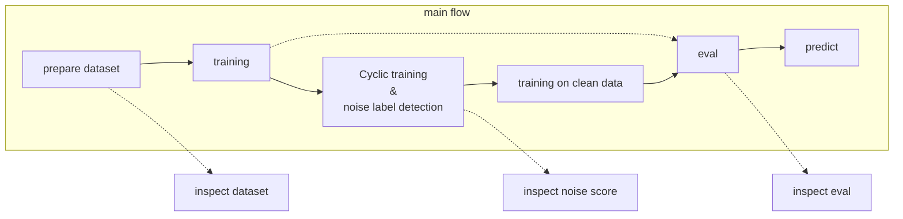

# O2U-Net(Classification with noisy label detection)
This is an unofficial implementation and differs from the original.

[O2U-Net: A Simple Noisy Label Detection Approach for Deep Neural Networks](https://openaccess.thecvf.com/content_ICCV_2019/papers/Huang_O2U-Net_A_Simple_Noisy_Label_Detection_Approach_for_Deep_Neural_ICCV_2019_paper.pdf)

## Operation flow

## Get started
Edit `docker-compose.override.yml` and `config/config.override.yml` 

## Build docker image
```bash
docker compose build
```

## Prepare dataset
You should prepare the dataset as csv file.
format is follow.
|image_path|class_id|class|fold
| ---- | ---- | ---- | ---- |
|/data/001.jpg|0|dog|3
|/data/002.jpg|1|cat|3
|/data/003.jpg|0|dog|4
|/data/004.jpg|2|human|4
|/data/005.jpg|1|cat|0

## Visualize Dataset
```bash
docker compose run --rm \
    --service-ports \
    main streamlit run run/inspect_dataset.py /data/train.csv
```

## train
```bash
docker compose run --rm \
    -u $(id -u):$(id -g) \
    main python -m run.train config=config/config.override.yml
```
## cyclic training
```bash
docker compose run --rm \
    -u $(id -u):$(id -g) \
    main python -m run.train_cyclic config=config/config.override.yml ckpt_pth=/output/ckpt/last.ckpt output_dir=/output/o2u
```
## Inspect O2U log
```bash
docker compose run --rm \
    --service-ports \
    main streamlit run run/inspect_o2ulog.py /output/o2u/o2u.csv
```
## evaluate
```bash
docker compose run --rm \
    -u $(id -u):$(id -g) \
    main python -m run.evaluate /output/config.yml /output/ckpt/last.ckpt /output/fold_0.csv
```

## exec cross validation
```bash
docker compose run --rm \
    -u $(id -u):$(id -g) \
    main bash script/run_cv.sh /output/cv config/config.override.yml
```

## Inspect Evaluate result
```bash
docker compose run --rm \
    --service-ports \
    main streamlit run run/inspect_evaluate.py /output/**/*.csv
```

## predict
```bash
docker compose run --rm \
    -u $(id -u):$(id -g) \
    main python -m run.predict /output/config.yml /output/ckpt/last.ckpt /output/preds.csv /data/test/*.jpg
```

## jupyter notebook
```bash
docker compose run --rm \
    --service-ports \
    main jupyter lab --ip=0.0.0.0 --allow-root --no-browser
```

## TODO
* code cleaning