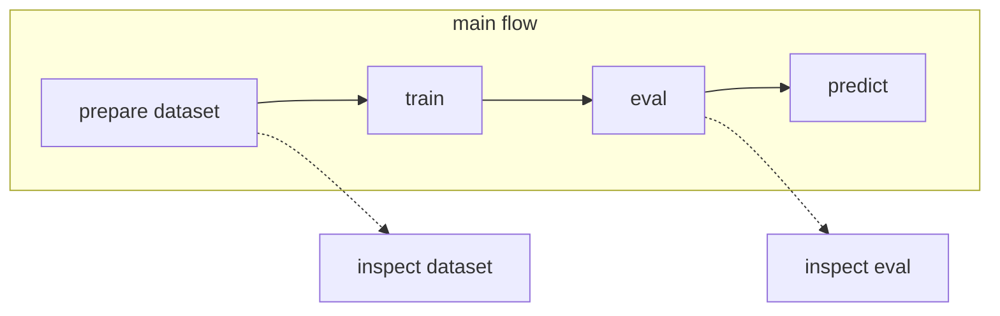

# Image Classification

## Operation flow

## Get started
Edit `docker-compose.override.yml` and `config/config.override.yml` 

## Build docker image
```bash
docker compose build
```

## Prepare dataset
You should prepare the dataset as csv file.
format is follow.
|image_path|mask_path|fold
| ---- | ---- | ---- | ---- |
|/data/001.jpg|/data/001_mask.npy|3
|/data/002.jpg|/data/002_mask.npy|3
|/data/003.jpg|/data/003_mask.npy|4
|/data/004.jpg|/data/004_mask.npy|4
|/data/005.jpg|/data/005_mask.npy|0

## train
```bash
docker compose run --rm \
    -u $(id -u):$(id -g) \
    main python -m run.train config=config/config.override.yml
```

