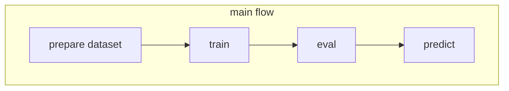

# Sound Classification
Creating a multi-class classification model from sound data.

Please check [Japanese version of README](README_jp_detail.md) for detailed instructions.

## Operation flow


## Get started
Edit `docker-compose.override.yml` and `config/config.override.yml`

## Build docker image
```bash
docker compose -f docker-compose.yml -f docker-compose.override.yml build
```

## Prepare dataset
You should prepare the dataset as csv file. The following command creates a csv about the sample data.

```bash
docker compose -f docker-compose.yml -f docker-compose.override.yml \
    run --rm \
    -u $(id -u):$(id -g) \
    main \
    python -m run.make_dataset /data/input /data/train.csv
```

The format of csv is follow.

|path|class_id|class|fold|frames|sr|
| ---- | ---- | ---- | ---- | ---- | ---- |
|/data/input/train_audio/abethr1/XC128013.ogg|0|abethr1|1|1459513|32000|
|/data/input/train_audio/abethr1/XC363501.ogg|0|abethr1|3|597682|32000|

## train
```bash
docker compose -f docker-compose.yml -f docker-compose.override.yml \
    run --rm \
    -u $(id -u):$(id -g) \
    main python -m run.train config=config/config.override.yml
```

## evaluate
```bash
docker compose -f docker-compose.yml -f docker-compose.override.yml \
    run --rm \
    -u $(id -u):$(id -g) \
    main python -m run.evaluate /output/seresnext26t_32x4d/config.yml /output/seresnext26t_32x4d/ckpt/last.ckpt /output/eval.csv
```

## exec cross validation
```bash
docker compose -f docker-compose.yml -f example/dogbreed/docker-compose.override.yml \
    run --rm \
    -u $(id -u):$(id -g) \
    main bash script/run_cv.sh /output/cv config/config.override.yml
```

## predict
```bash
docker compose -f docker-compose.yml -f example/dogbreed/docker-compose.override.yml \
    run --rm \
    -u $(id -u):$(id -g) \
    main python -m run.predict /output/seresnext26t_32x4d/config.yml /output/seresnext26t_32x4d/ckpt/last.ckpt /output/preds.csv /data/input/test_soundscapes/*.ogg
```

## jupyter notebook
```bash
cd ../..
docker compose \
    -f ./cvkit/sound_classification/docker-compose.yml -f ./cvkit/sound_classification/docker-compose.override.yml \
    run \
    --rm \
    --service-ports \
    main jupyter lab --ip=0.0.0.0 --allow-root --no-browser --NotebookApp.token=''
```
