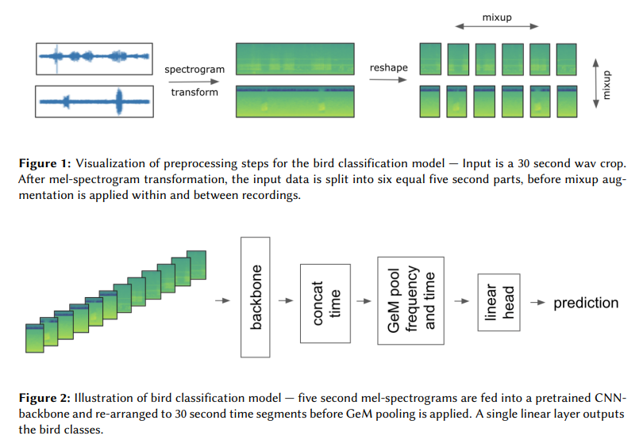

# Sound Classification
音データで多クラス分類モデルを作成する。

アーキテクチャは、鳥の鳴き声から鳥の種類を分類するKaggleコンペである[BirdCLEF-2021の2位](https://ceur-ws.org/Vol-2936/paper-134.pdf)のモデルに基づいています。

各音声ファイルで鳥が鳴いている時間帯は不明ですが、どこかの時間帯で鳴いているはずなので、さまざまな時間帯をmixupで混合し、できるだけ鳴き声を拾うようにしてモデルを学習する手法です。


以下の操作を学習時の前処理として行い、CNNのbackboneに渡します。
- 音声ファイルからランダムに30秒間の区間を切り出す
- 切り出した音声ファイルをメルスペクトログラムに変換し、音声を画像として扱う
- メルスペクトログラムを5秒ごとの6つの区間に分割する
- batch全体にわたって6つの区間のメルスペクトログラムを混合する（mixup）

推論は任意の5秒間で鳴いている鳥の種類を予測します。

## Directory
このリポジトリでは、各ディレクトリが特定の役割を持っています。

**各ディレクトリのファイルを変更することで、任意のデータセットに対応できます。**

```bash
config: クラス名などのパラメータを定義するYAMLファイルが格納されています
docker: Docker関連のファイル（Dockerfile等）が格納されています
run:    学習と推論を実行するPythonコードが格納されています
script: 学習と推論を実行するシェルスクリプトが格納されています
src:    runディレクトリのPythonコードから呼び出されるユーティリティ関数やモデルのコードが格納されています
```

## Prerequisites
このリポジトリを利用するには以下のツールが必要です:
- Docker
  - 動作確認はバージョン24.0.2で行っています。
- Docker Compose V2
  - 動作確認はバージョン2.18.1で行っています。
  - 注意: Compose V2 は `docker-compose` コマンドが `docker compose` になっています。

これらのツールのインストール方法は[公式ドキュメント](https://docs.docker.com/get-docker/)を参照してください。

## Sample data download
サンプルデータとしてKaggleのBirdCLEF-2023のデータをダウンロードします。
- このデータセットには、264種類の鳥の鳴き声の音声データが含まれています。
- [BirdCLEF-2023のサイト](https://www.kaggle.com/competitions/birdclef-2023/data)からzipファイルをダウンロードし、解凍してください。ダウンロードしたデータは ```../../data/input``` ディレクトリに配置すると仮定します。

## Get started
Dockerで環境を構築するために `docker-compose.override.yml` と dockerディレクトリのファイル を変更します。
- `docker-compose.override.yml`: このファイルでベースの `docker-compose.yml` を上書きします。マウントするDocker volumeの変更などに使用します。
- Pythonライブラリを追加したい場合はdockerディレクトリのファイルを変更します。

## Build docker image
`docker-compose.yml` を `docker-compose.override.yml` で上書きしてDockerイメージを作成します。

```bash
docker compose -f docker-compose.yml -f docker-compose.override.yml build
```

## Prepare dataset
`run/make_dataset.py` でデータセットのCSVファイルを作成します。

```bash
docker compose -f docker-compose.yml -f docker-compose.override.yml \
    run --rm \
    -u $(id -u):$(id -g) \
    main \
    python -m run.make_dataset /data/input /data/train.csv
```
- `run --rm` : Dockerコンテナを起動し、指定コマンドが実行完了したらコンテナを自動的に削除します。
- `-u $(id -u) $(id -g)` : 現在のユーザのユーザIDとグループIDを返して、コンテナ内のファイル操作をホストマシンのユーザと同じ権限で行います。
- `main` : mainはDocker Compose設定ファイル内で定義されているサービス名を指します。このサービスのコンテナがrunコマンドによって起動されます。
- `python -m run.make_dataset /data/input /data/train.csv` : 入力データのディレクトリ、出力するデータセットのCSVファイルのパスを引数を渡し、run/make_dataset.py を実行します。srcディレクトリを相対インポートするために python -m オプションを使用します。

このリポジトリでは、データセットのCSVファイルが次のフォーマットを満たす必要があります。
- 音声ファイルのパス、クラスid、クラス名、cross-validationのfold_id、音声ファイルのフレーム数、音声ファイルのサンプルレートの列が必要です。

|path|class_id|class|fold|frames|sr|
| ---- | ---- | ---- | ---- | ---- | ---- |
|/data/input/train_audio/abethr1/XC128013.ogg|0|abethr1|1|1459513|32000|
|/data/input/train_audio/abethr1/XC363501.ogg|0|abethr1|3|597682|32000|

## train
cross-validationの1foldの学習は `config/config.override.yml` と `run/train.py` を使用します。
- `config/config.override.yml`: このファイルでモデル学習のパラメータを上書きします。batch_size などは省略可能ですが、必須項目としてクラス名、データセットのCSVファイルのパス、出力ディレクトリの指定が必要です。

```bash
docker compose -f docker-compose.yml -f docker-compose.override.yml \
    run --rm \
    -u $(id -u):$(id -g) \
    main python -m run.train config=config/config.override.yml
```

## evaluate
validation setの精度評価は `run/evaluate.py` を使用します。
- 引数に学習に用いたconfig.yml、モデルのckpt、出力する評価結果のCSVファイルのパスを渡します。

```bash
docker compose -f docker-compose.yml -f docker-compose.override.yml \
    run --rm \
    -u $(id -u):$(id -g) \
    main python -m run.evaluate /output/seresnext26t_32x4d/config.yml /output/seresnext26t_32x4d/ckpt/last.ckpt /output/eval.csv
```

## exec cross validation
`script/run_cv.sh` でcross-validationの全foldを学習評価します。
- 引数に出力ディレクトリのパス、`config/config.override.yml` を渡します。

```bash
docker compose -f docker-compose.yml -f example/dogbreed/docker-compose.override.yml \
    run --rm \
    -u $(id -u):$(id -g) \
    main bash script/run_cv.sh /output/cv config/config.override.yml
```

## predict
`run/predict.sh` でラベルが無い音声ファイルを5秒単位で推論します。
- 引数に学習に用いたconfig.yml、モデルのckpt、出力する評価結果のCSVファイルのパス、推論する音声ファイルを渡します。

```bash
docker compose -f docker-compose.yml -f example/dogbreed/docker-compose.override.yml \
    run --rm \
    -u $(id -u):$(id -g) \
    main python -m run.predict /output/seresnext26t_32x4d/config.yml /output/seresnext26t_32x4d/ckpt/last.ckpt /output/preds.csv /data/input/test_soundscapes/*.ogg
```

## jupyter notebook
以下のコマンドでJupyter labを起動できます。起動中は `http://localhost:8888/` からアクセスできます。

```bash
cd ../..
docker compose \
    -f ./cvkit/sound_classification/docker-compose.yml -f ./cvkit/sound_classification/docker-compose.override.yml \
    run \
    --rm \
    --service-ports \
    main jupyter lab --ip=0.0.0.0 --allow-root --no-browser --NotebookApp.token=''
```
